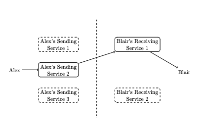
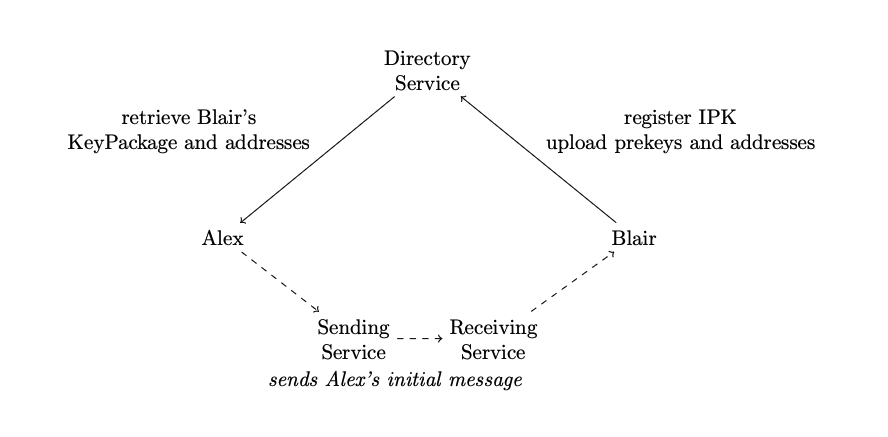
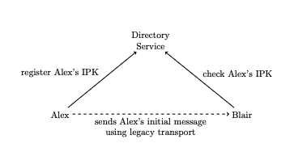

# Architecture & Protocol Model

## Problem

A fundamental problem in messaging today is that we overload addresses (e.g. phone numbers or email addresses) as identity. This unexpectedly fractures conversations when people change addresses. It also requires that people do work to unify conversations with the same person, by mapping different addresses to a single contact. Because addresses convey identify, it exposes metadata in transit about who is talking to each other.

Moreover, the use of static addresses faciltates cross-context tracking. As web and mobile platforms block cross-site and cross-app tracking, tracking is moving to email address and phone number as canonical identifiers for individuals. Our current architectural default that we accept messages from any sender enables spam and harassment, as it is costlier for a victim to change addresses than for an attacker to evade sender-identity blocking.

The Proton architecture addresses these issues by decoupling identity from the addresses used for message transmission. Message transmission, decoupled from identity, can now accomodate, flexible, interchangeable transmission routes with improved metadata privacy. People can interact directly with relationships and contextual identies as a first class concept, instead of indirectly by manipulating addresses in the ways we are familar with - sharing, blocking, and filling in contact cards.

## Protocol

The Proton Architecture extends the core idea of Double Ratchet key management - that two parties protect their communications with shared secrets that are updated with each message exchange - to the addresses that they use to deliver those messages to each other. Two parties Alex and Blair that have shared keys and addresses, are said to have a **Proton Relationship**, and we call the data structure that each party uses to store that shared state a **Proton**, to reflect the intuition that it has a synchronized partner, and they maintain that syncronization through message exchange.

### Continue existing conversations
Once Alex and Blair have established a proton relationship, they can use it to send messages in the following way:

Alex and Blair each enlist the help of multiple, persistently online services to perform the asymmetric roles of sending and receiving messages, each acting as one party's agent.  Alex's state (Proton) for their relationship with Blair contains information about Blair's [receiving service agents](reference/receiving-service.md), and addresses for Blair at each of those receiving services.

When Alex has a message to send to Blair, Alex attaches to the plaintext any updates to their Proton state (e.g. updates to Alex's receiving services or addresses), and encrypts the message to Blair using the agreed-upon key schedule.

To transmit this ciphertext, Alex chooses one of their sending services and one of Blair's receiving services. Alex can then route the message by presenting Alex's chosen sending service:
* The message ciphertext
* A URI for the chosen receiving service
* an address for Blair at that receiving service

The sending service does not need to know Blair's address, so Alex encrypts it with a public key published by the Receiving Service.

### Start new relationships
Initializing a proton relationship requires a bidirectional exchange of keys and addresses. In the simplest manner, Alex and Blair may simply exchange these directly between their devices through a local, peer to peer transport such as NFC or Bluetooth.

In many cases, Alex and Blair will rely on a persistently online Directory Service to broker an asynchronous, remote exchange. 

#### Brokered Directory Service
The most full-featured directory service can vend keys (long-term identity key and prekeys - call this a KeyPackage) and addresses for names within a namespace they assert authority over.

This architecture resembles the canonical implementation of most end to end encrypted messaging services today (Signal, iMessage, WhatsApp).

The directory service in this role grants permission to contact, and may subject this permission to rules within its own namespace.
#### Attesting Directory Service
Directory services can also attest to bindings of identity (keys) with names in their namespace without granting permission to contact by issuing addresses. This is useful for establishing trust for relationships established through an intermediary - either an insecure medium, or via a person to person introduction.

## Considerations

This architecture is alike SMTP in that senders and recipients make independent choices of agents for sending and receiving messages, analogously to mail submission agents and mail delivery agents. Unlike SMTP, these agents only handle ciphertexts, and clients are responsible for storage of plaintext messages. They may choose to enlist the aid of additional services to help synchroize this storage across devices, or provide recovery in case of device loss.

