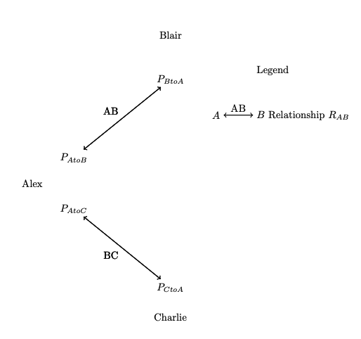
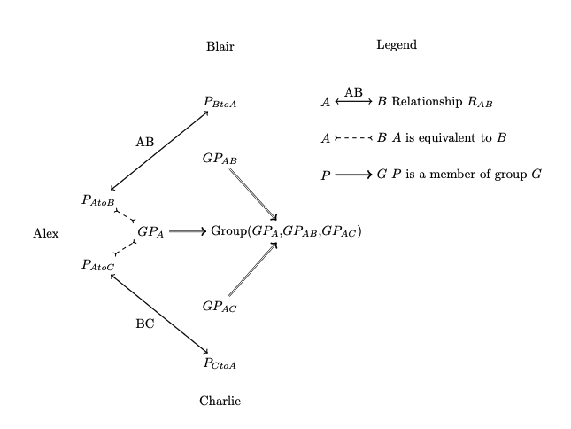
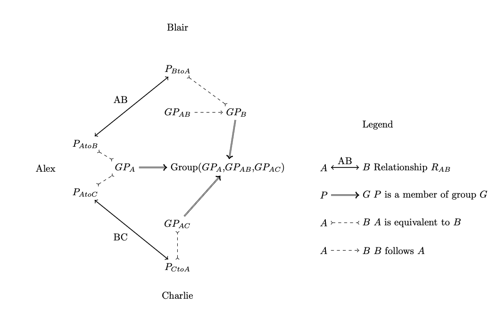
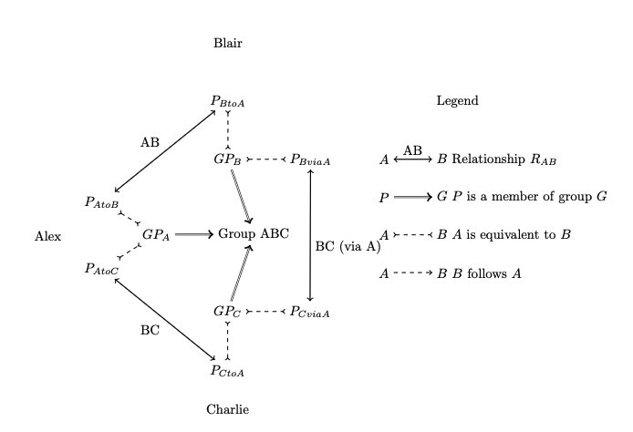

# Introductions

How do we form groups when we don't know if the participants can message each other - that is, if they have an established relationship? Introductions provide a powerful primitive for making new relationships and groups.

A personal introduction can be considered equivalent to starting a group of 3. Alex has relationships with Blair and Charlie, and wants to introduce them. Note that Alex has two independent cryptographic identities - Alex as Blair knows them (\\(P_{AtoB}\\)), and Alex as Charlie knows them(\\(P_{AtoC}\\))

Alex can introduce Blair and Charlie by starting a group among the three of them:

- Alex generates a new IPK and addresses for their identity in this group to form a new Particle \\(GP_A\\)
	- Alex sends \\(GP_A\\) to Blair and Charlie, and attests that \\(GP_A\\) is [equivalent to](identities.md) the cryptographic identities Blair and Charlie already know for Alex - \\(P_{A to B}\\) and \\(P_{A to C}\\), respectively.
- Alex also generates placeholder identities for Blair (\\(GP_{AB}\\)) and Charlie (\\(GP_{AC}\\)), and sends the respective public and private keys to Blair and Charlie.
	- That is, Alex sends Blair the public key for \\(GP_{AC}\\) and the private key for \\(GP_{AB}\\), and likewise for \\(AC\\).
	- This step is required because we do not want to reuse cryptographic identities in different conversations, and allows Alex to asynchronously start a group without relying on Blair and Charlie to generate a new key pair.
- Alex also generates new long-term addresses for Blair and Charlie, derived from the addresses in AB and AC, and sends them along with the placeholder identities.

- All three participants now have the necessary info to send each other bidirectional messages.

The state of this group is "Alex has created a group of 3, with placeholders for Blair and Charlie"

## Placeholder Identities

Blair can accept this invitation by claiming the placeholder:

- Like Alex, Blair generates a new identity (Particle) for its membership in this group \\(GP_B\\)
- Blair should attest to Alex that \\(GP_B\\) is equivalent to the existing identity \\(P_{B to A}\\).
- In the group, Blair should use the placeholder identity \\(GP_{AB}\\) to attest that it will be replaced by \\(GP_B\\). 

Note that Charlie does not yet have proof that Blair (\\(GP_B\\)) is not an alias for Alex, since Charlie only knows Blair through Alex. Charlie and Blair would need additional proofs of identity to establish a basis of trust independent of Alex.

If there is a natural context (e.g. the identities AB and AC were established from identities in the same directory), then Alex may also include that identity binding to identities in that directory in the initial introduction. But there may not be such context. If Alex and Blair exchanged keys in person, Alex doesn't have any additional identity information for Blair to share with Charlie.

If Charlie claims his invitation, then Blair and Charlie can also create a side conversation of their own, producing the final introduction state:

